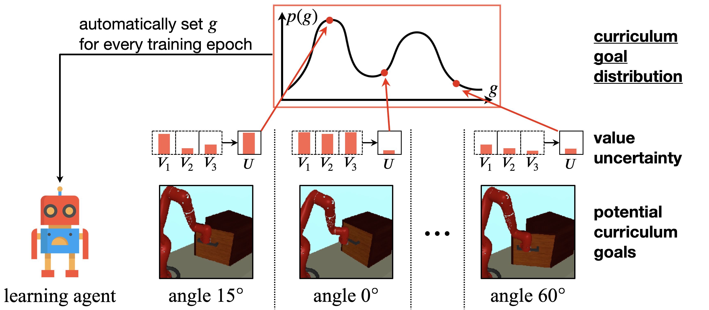

# Variational Curriculum Reinforcement Learning

This repository contains the official training and evaluation code for [Variational Curriculum Reinforcement Learning for Unsupervised Discovery of Skills](https://openreview.net/forum?id=U4r9JNyNZ7). It provides an implementation of VCRL variants on the Sawyer environment, including the presented method **Value Uncertainty Variational Curriculum (VUVC)**.

<p align='center'>
    
</p>

## Installation
All Python dependencies are listed in [`environment.yml`](environment.yml). To set up the environment, follow these steps:
run the following commands:
1. Install the Anaconda environment by running the following command:
    ```shell
    conda env create -f environment.yml
    ```
2. Activate `vcrl` environment:
    ```shell
    conda activate vcrl
    ```
3. Install the codebase by running:
    ```shell
    pip install -e .
    ```

## Usage
### General Usage
You can use the following command to run the training and evaluation code:
```shell
python -m scripts.METHOD \
    BASE_LOGDIR \
    --gpu_id GPU_ID \
    --snapshot_gap SNAPSHOT_GAP \
    --seed SEED \
    --spec EXP_SPEC
```
The placeholders should be replaced with the appropriate values:
* `METHOD`: Training method. Choose one of the VCRL variants: [`her`, `rig`, `edl`, `skewfit`, `vuvc`].
* `BASE_LOGDIR`: Sub-directory where the training and evaluation results will be saved, including the policy, replay buffer, and training log.
* `GPU_ID`: GPU ID to use.
* `SNAPSHOT_GAP`: Save the model every `SNAPSHOT_GAP` training epochs. The best performing model will be saved as `params.pkl`.
* `SEED`: Random seed. The seeds that we used in the paper range from 0 to 4.
* `EXP_SPEC`: Experiment specification. The results will be saved at `BASE_LOGDIR/vcrl_logs/ENV_ID/METHOD/EXP_SPEC/SEED/`.

By default, hyperparameters used in [the paper](https://openreview.net/pdf?id=U4r9JNyNZ7) are defined in the script files for each training method. To test different configurations, you can override them with your own choices.

Training with EDL is in two stages: 1) training a VAE along with a density-based exploration policy and 2) unsupervised training of skills.
To specify the training stage, use the `--mode` flag with the options `train_vae` or `train_policy` in the command line for [`edl`](scripts/SawyerDoorHook/edl.py).

### Examples
Here are some examples of running the code on the SawyerDoorHook environment:
```shell
# VUVC
python -m scripts.SawyerDoorHook.vuvc /tmp/vcrl/ --gpu_id 0 --snapshot_gap 20 --seed 0 --spec default

# HER
python -m scripts.SawyerDoorHook.her /tmp/vcrl/ --gpu_id 0 --snapshot_gap 20 --seed 0 --spec default

# RIG
python -m scripts.SawyerDoorHook.rig /tmp/vcrl/ --gpu_id 0 --snapshot_gap 20 --seed 0 --spec default

# Skew-Fit
python -m scripts.SawyerDoorHook.skewfit /tmp/vcrl/ --gpu_id 0 --snapshot_gap 20 --seed 0 --spec default

# EDL
python -m scripts.SawyerDoorHook.edl /tmp/vcrl/ --mode train_vae --gpu_id 0 --snapshot_gap 20 --seed 0
python -m scripts.SawyerDoorHook.edl /tmp/vcrl/ --mode train_policy --gpu_id 0 --snapshot_gap 20 --seed 0 --spec default
```

## Reference
```bibtex
@inproceedings{kim2023variational,
  title={Variational Curriculum Reinforcement Learning for Unsupervised Discovery of Skills},
  author={Kim, Seongun and Lee, Kyowoon and Choi, Jaesik},
  booktitle={International Conference on Machine Learning},
  year={2023},
}
```

## License
This repository is released under the MIT license. See [LICENSE](LICENSE) for additional details.

## Credits
This repository is extended from [rlkit](https://github.com/rail-berkeley/rlkit). For more details about the coding infrastructure, please refer to [rlkit](https://github.com/rail-berkeley/rlkit). \
The Sawyer environment is adapted from [multiworld](https://github.com/vitchyr/multiworld) where the Sawyer MuJoCo models are developed by [Vikash Kumar](https://github.com/vikashplus/sawyer_sim) under [Apache-2.0 License](https://github.com/vikashplus/sawyer_sim/blob/master/LICENSE).